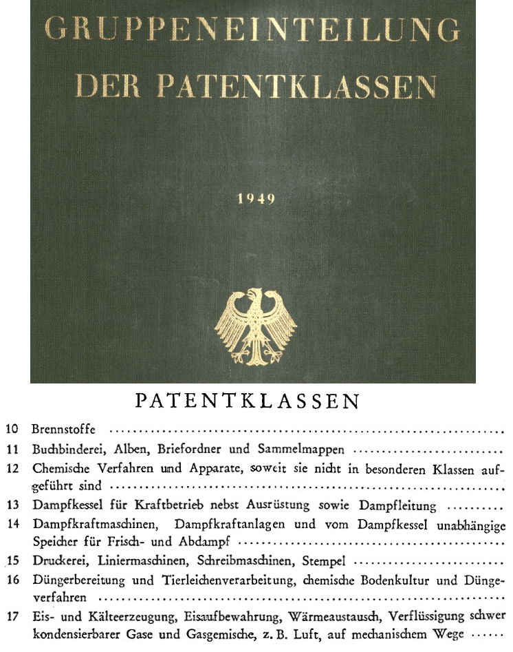

# Historical German Patent Technology Classes

This is a pure data repository, intended to give researchers working with historical German patent data easier access to the description of patent technology classes. I was surprised that I could not find such a digital reference, so if you were looking - here you go.
  
There are 89 major technology classes as well as the ones of the >540 minor classes. The major technology classes were in use since the inception of the German patent system in 1877, whereas the minor classes were added starting around 1900. There are also detailed technology groups within the minor classes. The historical German patent classes were later superseded by the International Classification, later [International Patent Classification (IPC)](https://en.wikipedia.org/wiki/International_Patent_Classification#History).

This repository contains titles of classes from 1910 and 1949. Between these two points in time, the technology content listed in the headers underwent some changes but remained broadly consistent. The repository also contains OCR of group-level descriptions. These are helpful in judging the actual technological content of a class. Note that all source materials are in German.

The visualization on the right-hand side shows the cover of one of the source books as well as a selection of major technology classes.

## Available data

* Patentklassen.xlsx - Excel file containing the titles of the major and minor classes as well as a rough assessment whether the contents are consistent between 1910 and 1949 (in German).
* OCR/Gruppeneinteilung.txt - OCR of "Gruppeneinteilung der Patentklassen" (See below, 'Technology groups with technology classes', in German). This gives a better impression of the actual technological content of the classes. The original scan is available upon request.

## TODO

- [ ] Add English translations of the technology classes.
- [x] Add OCR of the technology group titles.
- [ ] Add aggregate numbers of patent applications.

## Source

The patent class titles are taken from the following books:

* Taschenbuch des Patentwesens: Sammlung der den Geschäftskreis des Kaiserlichen Patentamts berührenden Gesetze und ergänzenden Anordnungen nebst Liste der Patentanwälte. Amtliche Ausgabe. Berlin: Heymanns, 1910.
* Deutsches Patent- und Markenamt. Gruppeneinteilung der Patentklassen. 6th ed. München, Detmold, Frankfurt, Berlin: Nauck, 1949.

## Attribution

If you would like to support my work, please cite the work for which I collected this information.

* Poege, Felix (2021): Competition and Innovation: The Breakup of IG Farben. mimeo.
* Poege, Felix (2021): Corporate innovation: the role of scientific discoveries, taxation and antitrust. Dissertation, LMU München: Faculty of Economics.

See also [my website](https://www.felixpoege.eu).

# Technologieklassen deutscher historischer Patente

Dies ist ein reines Daten-Repository. Ziel ist, Forschern eine digitale Version der Beschreibungen historischer deutscher Patentklassen zur Verfügung zu stellen. Für  meine eigene Forschung war so etwas nicht verfügbar, einen Umstand den ich hiermit beheben möchte. Es handelt sich dabei um die Gruppeneinteilung der "Deutschen Patentklassifikation" (DPK).

Angaben zu Quellen und Referenzen zu meiner eigenen darauf basierenden Arbeiten finden sich im englischen Text oben.
